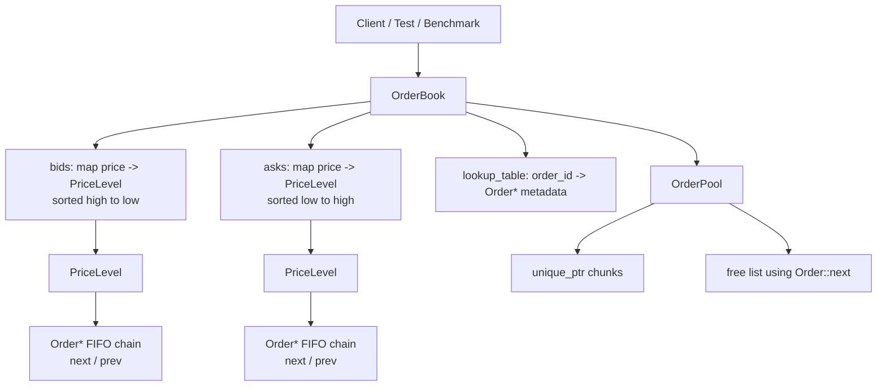
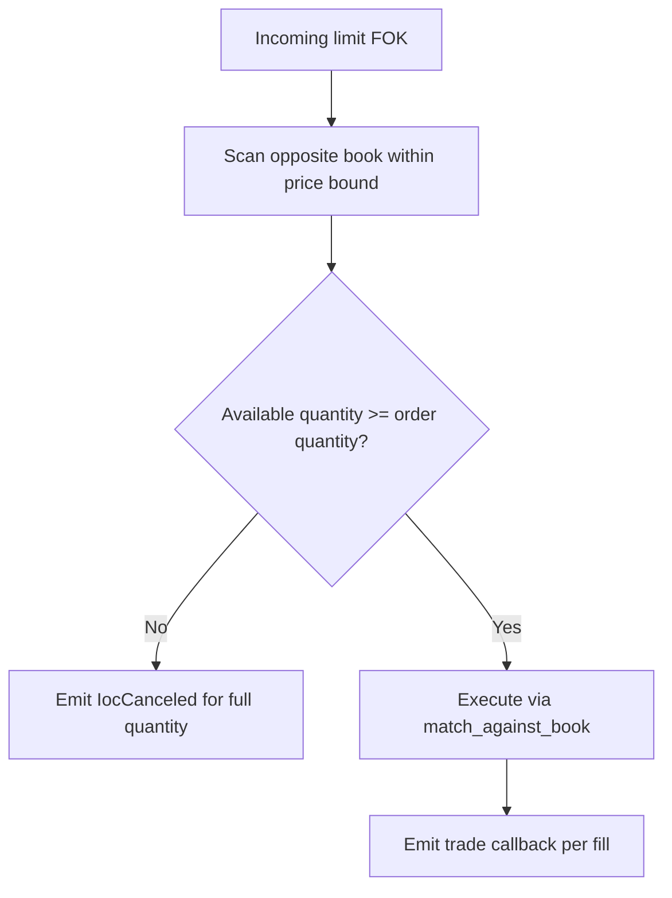
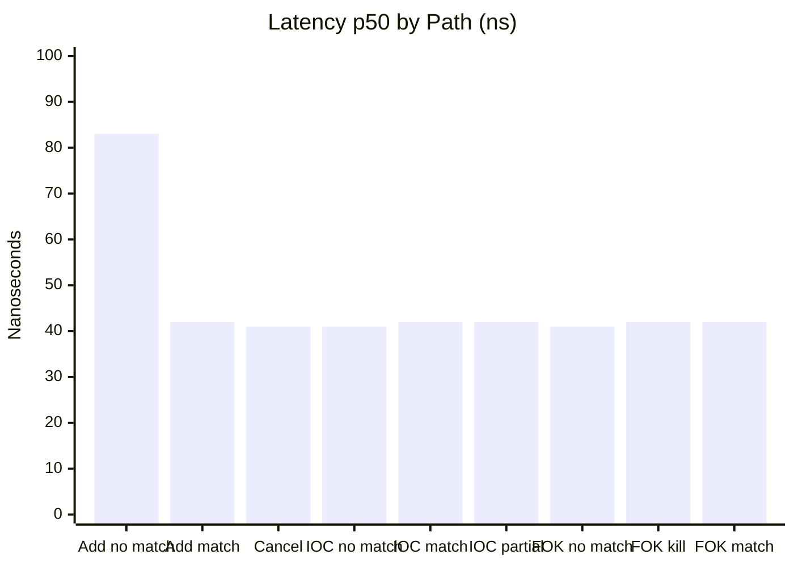
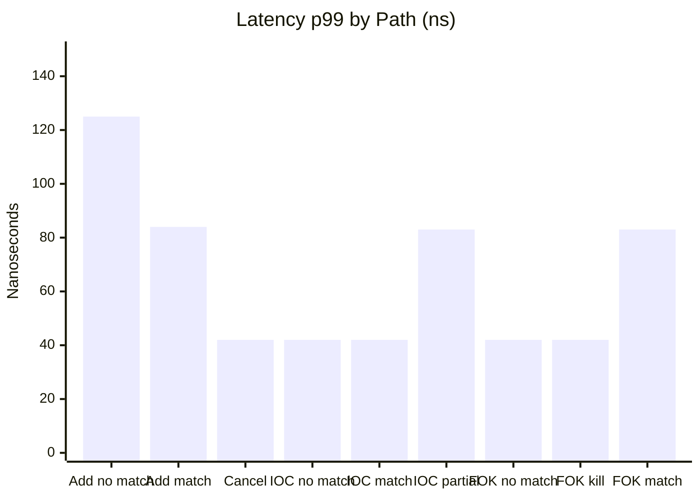

# Matching Engine

[](https://github.com/zylqheonix/Matching_Engine/actions/workflows/ci.yml)

**Repository:** [github.com/zylqheonix/Matching_Engine](https://github.com/zylqheonix/Matching_Engine)

## Overview

This project is a C++20 limit order book and matching engine focused on low-latency order matching. It supports resting limit orders, immediate-or-cancel market orders, limit IOC orders, limit FOK orders, order cancellation by engine-assigned id, trade callbacks, cancellation callbacks, unit/property tests, and benchmark tooling.

The core implementation uses an intrusive FIFO queue per price level and a chunked order pool. Resting orders are stored as stable `Order*` pointers allocated from `OrderPool`, and each price level links orders through `Order::next` and `Order::prev`. This avoids the per-node allocation pattern of `std::list<Order>` while preserving price-time priority.

## Features

- C++20 matching engine built with CMake.
- Price-time priority matching.
- Bid book ordered high-to-low and ask book ordered low-to-high.
- GTC limit orders: match immediately where possible, rest any remaining quantity.
- Limit IOC orders: match immediately where possible, cancel any remaining quantity.
- Limit FOK orders: pre-scan available liquidity, execute only if the full quantity can fill immediately.
- Market orders: IOC semantics with no price bound.
- Order cancellation by returned order id.
- Intrusive per-level order queues via `PriceLevel`.
- Chunked memory pooling via `OrderPool`.
- Trade callbacks for executed fills.
- IOC cancellation callbacks for unfilled IOC/FOK quantity.
- GoogleTest coverage for order book behavior, property invariants, price levels, and order pool behavior.
- Google Benchmark throughput benchmarks and custom latency percentile benchmarks.
- GitHub Actions CI for Release builds, tests, sanitizer builds, formatting, and benchmark smoke runs.

## Architecture

### High-Level Layout



### Core Data Structures

| Component | Purpose |
| --- | --- |
| `Order` | Represents an individual order. Resting orders also carry intrusive `next` and `prev` pointers. |
| `PriceLevel` | FIFO intrusive queue for all resting orders at one price. |
| `OrderPool` | Chunked allocator that gives stable `Order*` addresses and recycles freed orders. |
| `OrderBook` | Owns the bid/ask maps, order lookup table, pool, callbacks, and matching logic. |
| `LookupEntry` | Maps an order id to side, price, and resting `Order*` so cancellation can find it quickly. |

### Book Representation

The book stores price levels in `std::map`:

- `bids`: `std::map<uint64_t, PriceLevel, std::greater<uint64_t>>`
  - `bids.begin()` is the best bid.
- `asks`: `std::map<uint64_t, PriceLevel, std::less<uint64_t>>`
  - `asks.begin()` is the best ask.

Each `PriceLevel` stores orders in arrival order:

```text
PriceLevel 100

head                                                tail
 |                                                   |
 v                                                   v
Order #10 <-> Order #17 <-> Order #22 <-> Order #31
```

This preserves FIFO priority at a price level while allowing direct pointer unlinking for cancellation.

## Order Types

### GTC Limit Order

`add_limit_order(side, price, quantity)`

A good-till-cancel limit order trades against the opposite book up to its price limit. If it cannot fully fill, the remainder rests on the book.

Example: a buy limit at `100` can trade with asks priced `100` or lower. Any leftover quantity rests as a bid at `100`.

### Limit IOC Order

`add_limit_order_IOC(side, price, quantity)`

A limit immediate-or-cancel order trades against the opposite book up to its price limit. Any unfilled remainder is canceled and never rests.

Example: a buy IOC for `10 @ 100` with only `3` available at `100` or better will trade `3` and cancel `7`.

### Limit FOK Order

`add_limit_order_FOK(side, price, quantity)`

A limit fill-or-kill order is all-or-nothing. The engine first scans available liquidity inside the price limit. If the full quantity is available, it executes. If not, the whole order is canceled with no trades.

Example: a buy FOK for `10 @ 100` with only `7` available at `100` or better will cancel all `10` and emit no trade callbacks.



### Market Order

`add_market_order(side, quantity)`

Market orders use IOC semantics. They trade immediately against the opposite side with no price bound. Any unfilled remainder is canceled and never rests.

## Public API

The main interface lives in `include/order_book.hpp`.

```cpp
OrderBook book;

uint64_t resting_id = book.add_limit_order(Side::BUY, 100, 5);
uint64_t ioc_id = book.add_limit_order_IOC(Side::SELL, 99, 2);
uint64_t fok_id = book.add_limit_order_FOK(Side::BUY, 101, 10);
uint64_t market_id = book.add_market_order(Side::SELL, 4);

bool canceled = book.cancel_order(resting_id);

std::optional<uint64_t> best_bid = book.get_best_bid();
std::optional<uint64_t> best_ask = book.get_best_ask();
```

Every add API returns the engine-assigned order id. Orders that never rest, such as market, IOC, and FOK orders, still receive an id for callbacks and tracking, but `cancel_order(id)` will return `false` because those orders are not in the resting lookup table.

### Callbacks

`OrderBook` accepts two callbacks:

```cpp
std::vector<Trade> trades;
std::vector<IocCanceled> cancels;

OrderBook book(
    [&trades](const Trade &trade) {
      trades.push_back(trade);
    },
    [&cancels](const IocCanceled &cancel) {
      cancels.push_back(cancel);
    });
```

The trade callback fires once per fill slice. Sweeping multiple maker orders produces multiple callback invocations. The IOC cancellation callback fires for unfilled IOC, FOK, or market quantity.

## Matching Behavior

### Buy-Side Matching

A buy order matches asks from best to worst:

1. Start at `asks.begin()`, the lowest ask.
2. Stop if the ask price is above the buy limit.
3. Fill FIFO orders at the current price level.
4. Remove fully filled maker orders.
5. Erase empty price levels.
6. Continue until the incoming order is filled or the price bound is reached.

### Sell-Side Matching

A sell order matches bids from best to worst:

1. Start at `bids.begin()`, the highest bid.
2. Stop if the bid price is below the sell limit.
3. Fill FIFO orders at the current price level.
4. Remove fully filled maker orders.
5. Erase empty price levels.
6. Continue until the incoming order is filled or the price bound is reached.

## Repository Structure

```text
.
├── include/
│   ├── order.hpp
│   ├── order_book.hpp
│   ├── order_pool.hpp
│   └── price_level.hpp
├── src/
│   ├── order_book.cpp
│   ├── order_pool.cpp
│   └── price_level.cpp
├── tests/
│   ├── order_book_init_test.cpp
│   ├── order_book_limit_test.cpp
│   ├── order_book_property_test.cpp
│   ├── order_pool_test.cpp
│   └── price_level_test.cpp
├── benchmarks/
│   ├── order_book_benchmark.cpp
│   ├── order_book_latency_benchmark.cpp
│   ├── latency_percentiles.md
│   ├── baseline.md
│   ├── baseline_benchmark.json
│   ├── intrusive_latency.md
│   └── comparison_lists_vs_intrusive.md
├── .github/workflows/ci.yml
├── CMakeLists.txt
└── README.md
```

## Build

### Requirements

- CMake 3.20 or newer
- C++20 compiler
- Git

GoogleTest and Google Benchmark are fetched by CMake through `FetchContent`.

### Configure and Build

```bash
cmake -S . -B build -DCMAKE_BUILD_TYPE=Release
cmake --build build
```

The default build type is Release for single-config generators when no build type is provided.

### Sanitizer Builds

AddressSanitizer:

```bash
cmake -S . -B build-asan -DCMAKE_BUILD_TYPE=Debug -DME_ENABLE_ASAN=ON
cmake --build build-asan
ctest --test-dir build-asan --output-on-failure
```

ThreadSanitizer:

```bash
cmake -S . -B build-tsan -DCMAKE_BUILD_TYPE=Debug -DME_ENABLE_TSAN=ON
cmake --build build-tsan
ctest --test-dir build-tsan --output-on-failure
```

`ME_ENABLE_ASAN` and `ME_ENABLE_TSAN` are mutually exclusive.

## Testing

Run the full test suite:

```bash
ctest --test-dir build --output-on-failure
```

Test coverage includes:

| Test target | Coverage |
| --- | --- |
| `order_book_init_test` | Construction and order id assignment. |
| `order_book_limit_test` | GTC, market IOC, limit IOC, limit FOK, cancel, FIFO, price bounds, callbacks, and trade sequencing. |
| `order_book_property_test` | Randomized mixed-order invariant checks. |
| `price_level_test` | Intrusive FIFO behavior, erase behavior, and link integrity. |
| `order_pool_test` | Allocation, deallocation, reuse, chunk growth, and churn behavior. |

## Benchmarks

The project includes two benchmark executables:

| Target | Purpose |
| --- | --- |
| `order_book_benchmark` | Google Benchmark throughput tests with `items_per_second` counters. |
| `order_book_latency_benchmark` | Custom steady-state latency sampling that writes percentile tables to Markdown. |

### Throughput Benchmarks

Run every benchmark:

```bash
./build/order_book_benchmark
```

Run only IOC paths:

```bash
./build/order_book_benchmark --benchmark_filter=Ioc
```

Run only FOK paths:

```bash
./build/order_book_benchmark --benchmark_filter=Fok
```

Write raw Google Benchmark JSON:

```bash
./build/order_book_benchmark \
  --benchmark_min_time=0.05s \
  --benchmark_format=json \
  --benchmark_out=benchmarks/latest_benchmark.json
```

### Latency Percentiles

```bash
./build/order_book_latency_benchmark \
  --ops=200000 \
  --out=benchmarks/latency_percentiles.md
```

The current saved latency snapshot is in `benchmarks/latency_percentiles.md`.

### Latest Latency Snapshot

Captured with `200000` samples per path, Release build, nanoseconds:

| Path | p50 | p90 | p99 | p99.9 |
| --- | ---: | ---: | ---: | ---: |
| add (no match) | 83 | 84 | 125 | 208 |
| add (matches) | 42 | 42 | 84 | 500 |
| cancel | 41 | 42 | 42 | 83 |
| limit IOC (no match) | 41 | 42 | 42 | 84 |
| limit IOC (matches) | 42 | 42 | 42 | 125 |
| limit IOC (partial fill) | 42 | 42 | 83 | 125 |
| limit FOK (no match) | 41 | 42 | 42 | 84 |
| limit FOK (kill) | 42 | 42 | 42 | 125 |
| limit FOK (matches) | 42 | 42 | 83 | 125 |

### Latency Visualization





### `std::list` vs Intrusive List Results

Earlier versions stored each price level as `std::list<Order>`. The current implementation uses `PriceLevel` plus `OrderPool`.

| Benchmark | List throughput | Intrusive throughput | Change |
| --- | ---: | ---: | ---: |
| AddLimitOrder/64 | 23.0 M/s | 21.9 M/s | -4.8% |
| AddLimitOrder/512 | 23.3 M/s | 26.3 M/s | +12.9% |
| CancelOrder/64 | 36.8 M/s | 45.3 M/s | +23.1% |
| CancelOrder/512 | 46.6 M/s | 63.8 M/s | +36.9% |
| MatchHeavy/64 | 26.0 M/s | 30.0 M/s | +15.4% |
| MatchHeavy/512 | 33.7 M/s | 42.3 M/s | +25.5% |

```mermaid
xychart-beta
    title "Throughput: List vs Intrusive (M ops/s)"
    x-axis ["Add64", "Add512", "Cancel64", "Cancel512", "Match64", "Match512"]
    y-axis "M ops/s" 0 --> 70
    bar "List" [23.0, 23.3, 36.8, 46.6, 26.0, 33.7]
    bar "Intrusive" [21.9, 26.3, 45.3, 63.8, 30.0, 42.3]
```



Detailed benchmark notes are available in:

- `benchmarks/comparison_lists_vs_intrusive.md`
- `benchmarks/baseline.md`
- `benchmarks/intrusive_latency.md`
- `benchmarks/latency_percentiles.md`

### Benchmark Hygiene

- Use Release builds (`-O3 -DNDEBUG`) for performance measurements.
- Keep sanitizers disabled during benchmark runs.
- Record machine details with results.
- Keep workload shape stable when comparing runs.
- Prefer isolated machine conditions with minimal background load.
- On Linux, consider pinning to a core:

```bash
taskset -c 2 ./build/order_book_latency_benchmark --ops=1000000
```

Benchmark results are machine and environment dependent. Treat saved numbers as snapshots, not absolute guarantees.

## Continuous Integration

GitHub Actions runs:

- Release configure, build, and test.
- Debug AddressSanitizer configure, build, and test.
- Benchmark smoke test.
- `clang-format` dry-run format check.

Workflow file: `.github/workflows/ci.yml`

## Design Notes

### Intrusive Lists

`PriceLevel` does not allocate wrapper nodes. Instead, every resting `Order` contains its own `next` and `prev` pointers. This reduces allocator pressure and makes cancellation straightforward once the order pointer is known.

### Order Pool

`OrderPool` allocates chunks of `Order` objects and links unused slots into a free list. Allocating a resting order pops from the free list; deallocating a filled or canceled order pushes it back.

This gives stable object addresses for resting orders and avoids frequent general-purpose heap allocation on hot paths.

### Lookup Table

The lookup table maps an order id to the order's side, price, and `Order*`. Cancellation uses this to jump directly to the relevant `PriceLevel` and unlink the order without searching every level.

### FOK Pre-Scan

FOK cannot partially execute and then roll back. The implementation therefore scans available liquidity before mutating the book. Only if enough quantity exists inside the price bound does it call the normal matching path.

## Roadmap

Potential next improvements:

- Rename API methods to a consistent style, for example `add_limit_order_ioc` and `add_limit_order_fok`.
- Add account or owner identifiers to support self-trade prevention.
- Add order modification or cancel-replace support.
- Add a market data snapshot API for book depth.
- Add a fixed tick-range price ladder or cyclic array for instruments with bounded price ranges.
- Add stricter benchmark reports for pinned Linux runs.
- Add persistent trade and cancel event sinks.

## License

This project is licensed under the MIT License. See `LICENSE`.
